# Gobierno de Datos — Diccionario de Datos Funcional y Técnico | La Positiva

Solución de **gobierno de datos end-to-end** que digitaliza, automatiza y pone en producción el Diccionario de Datos corporativo de **La Positiva**. Integra una arquitectura Medallion sobre Unity Catalog (Bronze → Silver → Gold), pipelines orquestados con Azure Data Factory, notebooks Databricks para ingesta y transformación, un **dashboard gerencial** para monitoreo del diccionario, y una **aplicación interactiva** donde los usuarios de negocio gestionan los datos en tiempo real — todo desplegado a producción mediante un flujo CI/CD con GitHub Actions.

**Stack:** Python · Streamlit · Azure Data Factory · Databricks · Delta Lake · Unity Catalog · SQL Connector · GitHub Actions · Databricks Apps · Lakeview Dashboard

---

## ¿Qué problema resuelve este proyecto?

### El problema: un diccionario de datos manual, disperso y dependiente de personas

En una empresa como La Positiva, el **Diccionario de Datos** es un activo crítico: define qué significa cada dato, quién lo genera, cómo se calcula, cuáles son sus reglas de calidad y de dónde proviene. Sin embargo, en la práctica este diccionario se mantenía en hojas de cálculo y documentos dispersos, lo que generaba problemas estructurales:

- **Inconsistencia de definiciones:** distintas áreas tenían versiones diferentes del mismo concepto de negocio, con nombres, cálculos y responsables distintos.
- **Dependencia de personas clave:** actualizar el diccionario requería involucrar al Data Owner o Data Steward de cada dominio en procesos largos de revisión, aprobación y llenado de formularios manuales.
- **Sin versionado ni trazabilidad:** no había historial de cambios, ni forma de saber quién modificó qué y cuándo.
- **Desconexiun de la plataforma de datos:** el diccionario era un documento separado del dato real, sin integración con las tablas, pipelines ni dashboards.
- **Reglas de calidad sin operatividad:** las reglas existían en papel pero no estaban vinculadas a ningún proceso automático de validación.

### La solución: automatizar el ciclo de vida del diccionario con una plataforma de datos

Este proyecto transforma el diccionario de datos en un **activo vivo dentro de la plataforma Databricks**, eliminando procesos manuales y dependencias innecesarias:

- Los **usuarios de negocio** acceden a una app web y gestionan conceptos, reglas y trazabilidad directamente, sin asistencia técnica ni procesos burocráticos.
- Cada inserción o edición **persiste inmediatamente** en las tablas Delta de la capa Bronze en Unity Catalog con timestamp automático.
- La información fluye automáticamente a las capas Silver y Gold mediante pipelines, estando **disponible para análisis y dashboards** sin intervención adicional.
- El **dashboard gerencial** permite a directivos y Data Owners ver en tiempo real el estado del diccionario: cuántos conceptos hay, qué dominios están completos, qué reglas de calidad faltan por definir.
- **Delta Lake** garantiza el versionado automático de cada cambio, con capacidad de auditoria y rollback.
- El código y configuración se gestionan en **GitHub** con un flujo CI/CD que despliega automáticamente todo el entorno a producción.

---

## Arquitectura

```
 ┌─────────────────────────────────┐
 │  STORAGE (Azure Data Lake)       │  ← Datasets RAW (archivos fuente)
 └─────────────────────────────────┘
                  │
     Azure Data Factory (trigger automático)
                  │  Dispara el Workflow de Databricks
                  ▼
 ┌─────────────────────────────────┐
 │  DATABRICKS WORKFLOW              │
 │  1. Preparación Ambiente          │  ← Crea catálogo, schemas y tablas Medallion
 │  2. Ingesta Bronze (x3)           │  ← Carga datos RAW en catalog_au.bronze
 │  3. Transformación Silver         │  ← Limpieza, estandarización y enriquecimiento
 │  4. Carga Gold                    │  ← Agregaciones y modelos para consumo
 │  5. Grants Medallion              │  ← Permisos por capa y por rol
 └─────────────────────────────────┘
                  │
                  ▼
 ┌─────────────────────────────────┐
 │  UNITY CATALOG — catalog_au      │
 │  ├── Bronze  (datos ingestados)    │  ← Escritura directa desde la App
 │  ├── Silver  (datos transformados)  │
 │  └── Gold    (datos agregados)      │  ← Base para dashboard y reportes
 └─────────────────────────────────┘
          │                    │
          ▼                    ▼
 ┌─────────────┐  ┌────────────────┐
 │ Dashboard      │  │ Databricks App  │
 │ Gerencial      │  │ gobierno-datos  │
 │ (Lakeview)     │  │ (Streamlit)     │
 └─────────────┘  └────────────────┘
 KPIs · dominios      CRUD interactivo
 reglas · completitud Conceptos · Reglas
                      Trazabilidad
```

**Flujo de datos:** Los datasets RAW almacenados en Azure Data Lake son procesados automáticamente por Azure Data Factory, que dispara un Workflow en Databricks. Este workflow ejecuta en secuencia los notebooks de preparación, ingesta a Bronze, transformación a Silver, carga a Gold y configuración de permisos. La capa Bronze también recibe escrituras directas desde la Databricks App, y tanto el dashboard gerencial como la app consumen desde Unity Catalog.

---

## Azure Data Factory — Orquestación del Pipeline

Azure Data Factory actúa como el orquestador principal del pipeline de datos: detecta la llegada de archivos RAW en el storage y dispara automáticamente el Workflow de Databricks que procesa la data capa por capa (Bronze → Silver → Gold).

### Workflow ADF

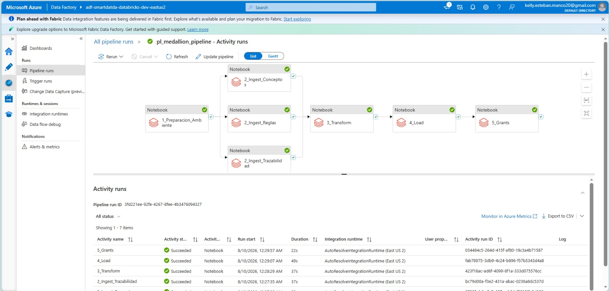

Pipeline principal de ADF que encadena las actividades de lectura desde ADLS y disparo del Workflow de Databricks. Cada actividad tiene manejo de errores y reintentos configurados para garantizar la resiliencia del proceso.

---

### Conector ADF ↔ Databricks

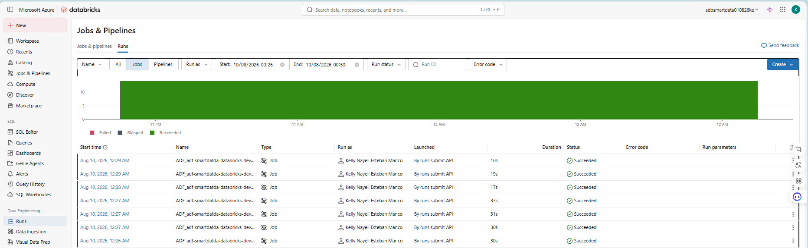

Linked service de ADF hacia Databricks que permite ejecutar el Workflow de notebooks directamente desde el pipeline. La conexión usa autenticación con token y apunta al workspace de Databricks productivo.

---

## Notebooks de Proceso — Medallion Pipeline

El pipeline está implementado como una secuencia de notebooks Databricks organizados por responsabilidad, que transforman los datos desde el RAW hasta la capa Gold.

| Notebook | Capa | Descripción |
|---|---|---|
| `1.Preparacion_Ambiente` | Setup | Crea el catálogo `catalog_au`, los schemas Bronze/Silver/Gold y las tablas Delta con sus esquemas definitivos |
| `2.Ingest_Conceptos_Negocio` | Bronze | Ingesta los Conceptos de Negocio desde el dataset RAW hacia `catalog_au.bronze.conceptos_negocio` |
| `2.Ingest_Reglas_Calidad` | Bronze | Ingesta las Reglas de Calidad hacia `catalog_au.bronze.reglas_calidad` |
| `2.Ingest_Trazabilidad` | Bronze | Ingesta los registros de Trazabilidad hacia `catalog_au.bronze.trazabilidad` |
| `3.Transform` | Silver | Limpieza, estandarización de campos, desduplicación y enriquecimiento Bronze → Silver |
| `4.Load` | Gold | Agrega, consolida y prepara los datos Silver → Gold para consumo por dashboard y reportes |
| `5.Grants_Medallion` | Seguridad | Configura los permisos de Unity Catalog por capa: quién puede leer Bronze, Silver, Gold y quién puede escribir |

---

## Dashboard Gerencial — Diccionario de Datos Funcional y Técnico

Dashboard Lakeview construido sobre las capas Silver y Gold de Unity Catalog. Provee a la gerencia y a los Data Owners una vista consolidada del estado del Diccionario de Datos en tiempo real.


El dashboard expone los siguientes indicadores clave:

- **Total Entidades de Dato:** cantidad total de conceptos registrados en el diccionario (2,87 mil)
- **Dominios y Subdominios:** clasificación del diccionario por dominio (Persona, Póliza) y subdominio (5 subdominios activos)
- **Datos Críticos:** volumen de datos marcados como críticos para el negocio (2,32 mil)
- **Con Regla de Calidad:** cobertura de reglas definidas sobre el total de entidades (2,81 mil)
- **Con Trazabilidad:** entidades con linaje documentado (2,87 mil)
- **Datos Críticos, Personales y Sensibles por Dominio:** gráfico de barras comparativo por dominio
- **Distribución por Prioridad:** donut chart con prioridad Alta / Media / Baja
- **Reglas de Calidad por Principio y Dominio:** barras por Completitud, Consistencia, Integridad, Precisión y Validez
- **Completitud del Diccionario por Subdominio:** tabla con `% concepto_negocio`, `% regla_calidad`, `% trazabilidad` y los faltantes por cada pilar

Este dashboard permite tomar decisiones sobre el gobierno de datos sin entrar a la plataforma técnica: visibilidad ejecutiva del diccionario en un solo documento accesible para gerencia.

---

## Aplicación — Gobierno de Datos

Interfaz web interactiva desplegada como **Databricks App** (Streamlit). Permite a los usuarios de negocio gestionar el Diccionario de Datos de La Positiva directamente sobre las tablas Bronze de Unity Catalog, sin necesidad de acceso técnico a Databricks. El Data Owner o Data Steward accede, completa los datos y el sistema los registra automáticamente — eliminando el proceso manual de llenado de formularios y envío por correo.

### Interfaz principal

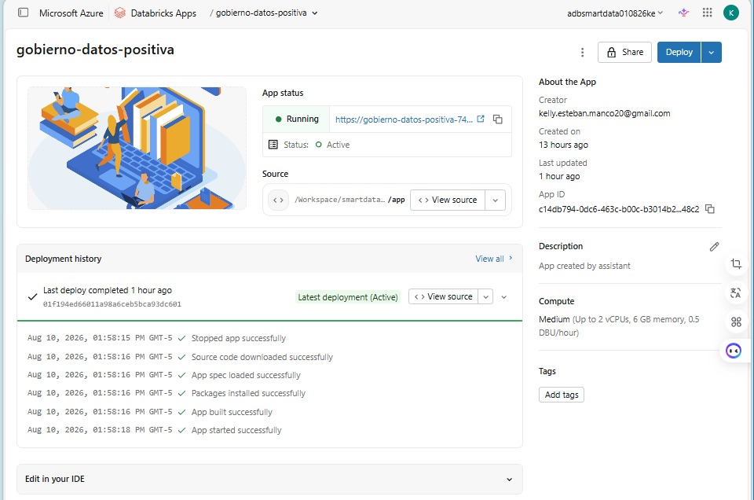

La app organiza la gestión en cuatro pestañas: **Dashboard** con KPIs en tiempo real, **Conceptos de Negocio**, **Reglas de Calidad** y **Trazabilidad**. Cada módulo permite consultar registros, insertar nuevos mediante formularios validados, editar cualquier campo y eliminar entradas obsoletas.

---

### Dashboard — Resumen ejecutivo

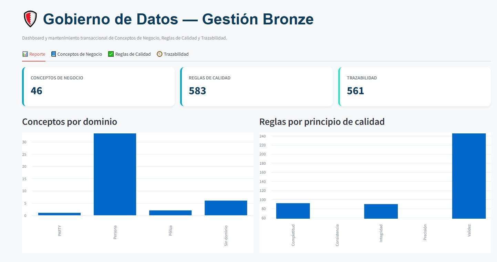

Vista consolidada con KPIs en tiempo real: total de Conceptos de Negocio registrados, Reglas de Calidad definidas, registros de Trazabilidad cargados y timestamp de última actualización. Incluye gráficos de distribución por dominio y por principio de calidad para identificar rápidamente qué áreas están más avanzadas y cuáles tienen brechas.

---

### Inserción de registros — Formulario

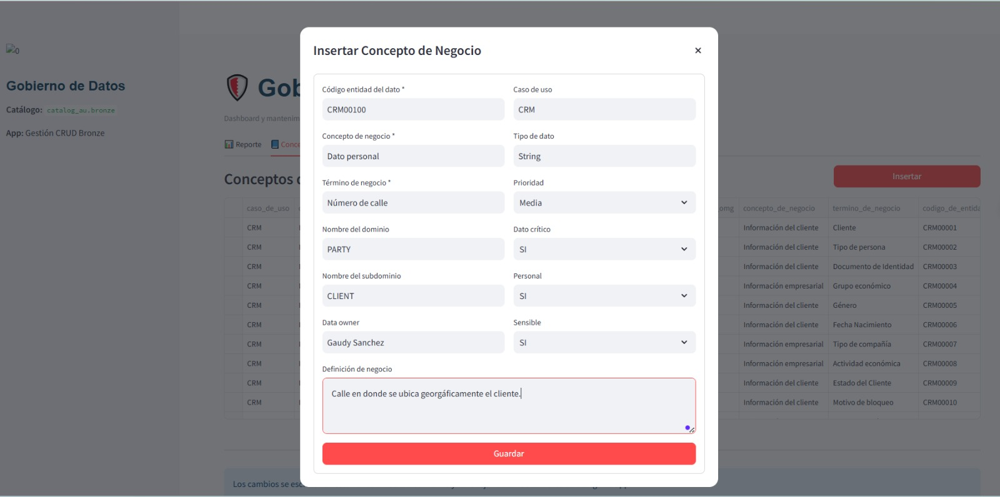

Formulario modal con validación de campos obligatorios. El usuario completa los atributos del concepto — código de entidad, dominio, subdominio, Data Owner, tipo de dato, prioridad, si es dato crítico, personal o sensible, definición de negocio, lógica de cálculo, entre otros — y al guardar el registro se persiste inmediatamente en la tabla Delta `catalog_au.bronze.conceptos_negocio` con `ingestion_date` automático.

---

### Registro insertado en tabla

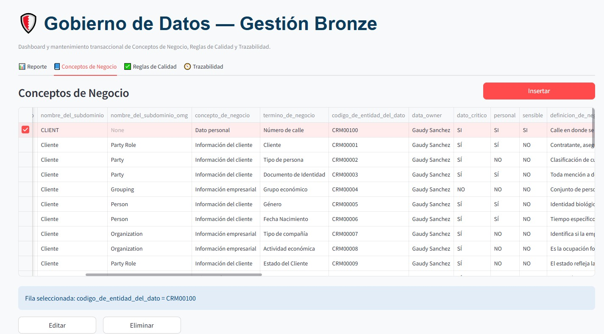

Confirmación visual de la inserción: el nuevo registro aparece en la tabla interactiva con todos sus atributos. Desde esta vista el usuario puede seleccionar cualquier fila para editarla o eliminarla con un solo clic, sin escribir SQL ni contactar al equipo de datos.

---

### Reglas de Calidad

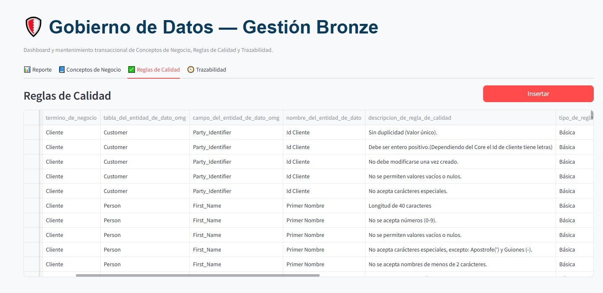

Módulo para gestionar las Reglas de Calidad de los datos. Cada regla incluye: ID único, término de negocio asociado, descripción, tipo de regla, principio de calidad (completitud, exactitud, consistencia, etc.), umbrales superior e inferior aceptables, periodicidad de evaluación y Data Owner responsable del cumplimiento.

---

### Trazabilidad

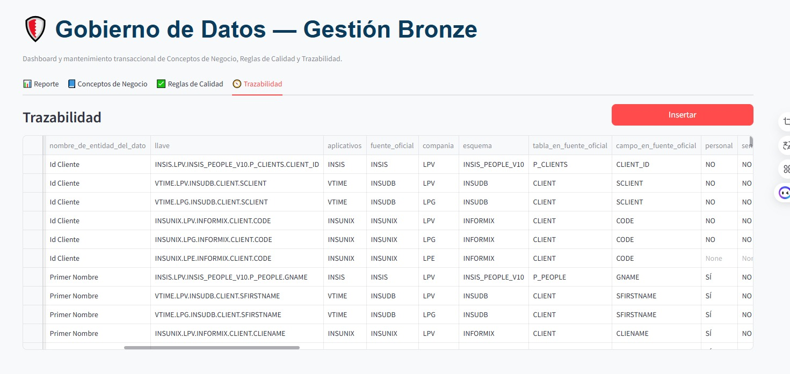

Módulo de Trazabilidad que documenta el linaje completo de cada entidad: sistema fuente, tabla y campo de origen, aplicativos que generan el dato, Data Owner, Data Custodian, periodicidad de actualización, formato y longitud del dato, e indicador de llave primaria. Permite rastrear cualquier dato desde su consumo en Gold hasta su origen en los sistemas transaccionales.

---

## Control de Versiones — GitHub

Todo el código fuente — notebooks, app, configuración de ADF, DDL de tablas y workflows — se gestiona en un **Git Folder de Databricks** conectado a GitHub. El trabajo se realiza en la rama `dev` y se promueve a `main` mediante Pull Request, lo que dispara automáticamente el deploy a producción.

### Repositorio y ramas

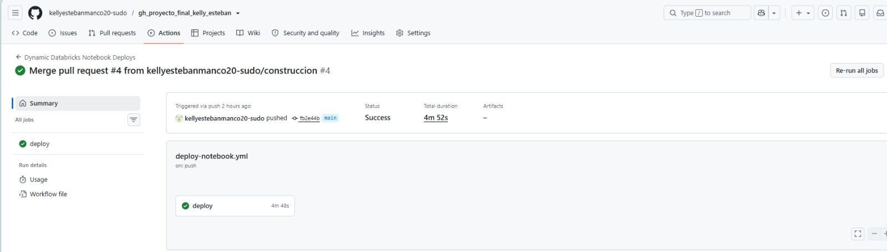

---

### Historial de commits

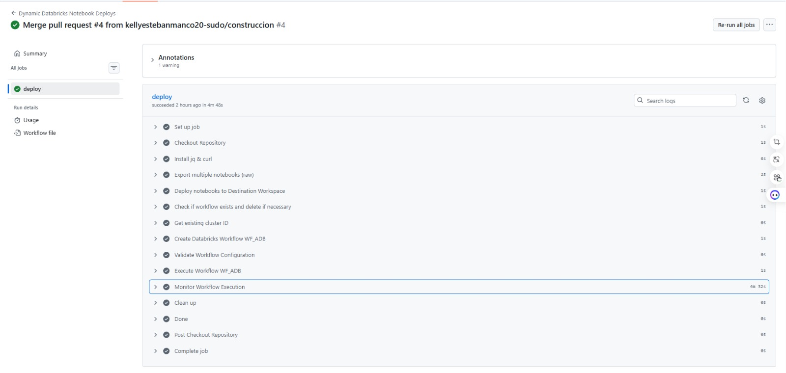

Cada cambio queda versionado con commit descriptivo, autor y timestamp. El historial de Git garantiza trazabilidad completa del desarrollo y permite revertir cualquier cambio en caso de error.

---

## Pase de Desarrollo a Producción (CI/CD)

El ciclo de vida del proyecto sigue un flujo controlado **DEV → PROD** totalmente automatizado. Todo lo desarrollado y validado en el entorno de desarrollo se despliega a producción mediante GitHub Actions sin intervención manual.

### Cómo funciona el flujo CI/CD

```
 Databricks DEV
       │  Git Folder → push a rama dev
       ▼
   GitHub (PR dev → main)
       │  Merge a main dispara: .github/workflows/deploy-notebook.yml
       ▼
   GitHub Actions
       │  El workflow YML ejecuta automáticamente:
       │  ├── Copia todos los notebooks a Databricks PRD
       │  ├── Crea/actualiza los Jobs y Workflows en PRD
       │  ├── Despliega la Databricks App en PRD
       │  └── Aplica la parametrización del entorno productivo
       ▼
 Databricks PROD ✅
       Todo listo para producción
```

### Transferencia DEV → PRD

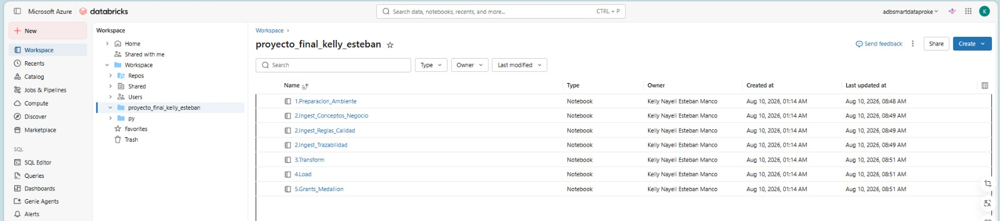

Evidencia del proceso de transferencia: los notebooks, la configuración del pipeline y el código de la app se copian al workspace productivo mediante el workflow YML, garantizando que dev y prod son idénticos en estructura y código.

---

### Job de Producción — Workflow creado automáticamente

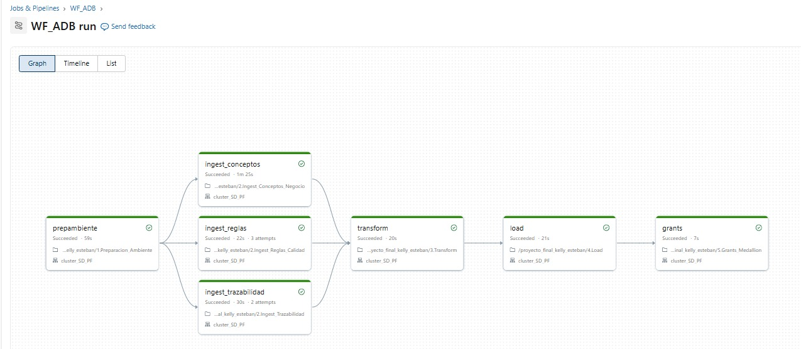

Databricks Job creado automáticamente en producción por el workflow YML. Orquesta la ejecución de los notebooks en el orden correcto (Preparación → Ingesta Bronze → Transformación Silver → Carga Gold → Grants), con manejo de dependencias entre tareas y configuración de notificaciones de fallo.

---

### Job de Producción — Detalle de tareas

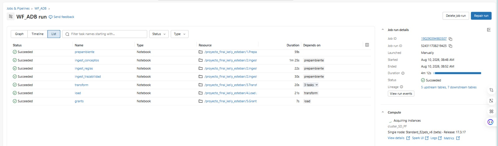

Grafo de dependencias del Job productivo: cada tarea apunta al notebook correspondiente, con el compute configurado para Serverless y los parámetros de entorno productivo. La ejecución fue **exitosa en producción** en el primer deploy.

---

## Datos del Proyecto

| Métrica | Valor |
|---|---|
| Empresa | La Positiva |
| Entidades del diccionario | 3 (Conceptos de Negocio · Reglas de Calidad · Trazabilidad) |
| Capas Medallion | Bronze · Silver · Gold — `catalog_au` |
| Notebooks del pipeline | 7 (preparación · 3 de ingesta · transformación · carga · grants) |
| Orquestación ETL | Azure Data Factory (trigger automático sobre ADLS) |
| Aplicativo | Databricks App (Streamlit) — CRUD SELECT · INSERT · UPDATE · DELETE |
| Dashboard gerencial | Lakeview — “Diccionario de Datos Funcional y Técnico” |
| Compute | Serverless SQL Warehouse (`4dd2eee58725c00e`) |
| Control de versiones | GitHub — Git Folder Databricks (dev → main) |
| CI/CD | GitHub Actions — `deploy-notebook.yml` → deploy automático a PRD |
| Autenticación app | SQL Connector + PAT Token (`APP_PAT_TOKEN`) |

---

## Estructura del Repositorio

```
gh_proyecto_final_kelly_esteban/
│
│  ── CI/CD ──────────────────────────────────────────────────
├── .github/
│   └── workflows/
│       └── deploy-notebook.yml   ← Workflow CI/CD: copia notebooks a PRD, crea
│                                    Jobs, despliega App al hacer merge a main
│
│  ── PIPELINE DE DATOS ────────────────────────────────────────
├── proceso/
│   ├── 1.Preparacion_Ambiente       ← Crea catalog_au, schemas Bronze/Silver/Gold
│   │                                  y todas las tablas Delta con su DDL
│   ├── 2.Ingest_Conceptos_Negocio   ← Ingesta de Conceptos de Negocio RAW → Bronze
│   ├── 2.Ingest_Reglas_Calidad      ← Ingesta de Reglas de Calidad RAW → Bronze
│   ├── 2.Ingest_Trazabilidad        ← Ingesta de Trazabilidad RAW → Bronze
│   ├── 3.Transform                  ← Transformación Bronze → Silver (limpieza,
│   │                                  estandarización, desduplicación)
│   ├── 4.Load                       ← Carga Silver → Gold (agregaciones y modelos
│   │                                  listos para dashboard y consumo analítico)
│   └── 5.Grants_Medallion           ← Permisos Unity Catalog por capa y por rol
│
│  ── PREPARACIÓN DE AMBIENTE ─────────────────────────────────
├── PrepAmb/
│   └── 1.Preparacion_Ambiente       ← Notebook de setup inicial del entorno
│                                    (catálogo, schemas, tablas, configuración)
│
│  ── SEGURIDAD ────────────────────────────────────────────────
├── seguridad/
│   └── 5.Grants_Medallion           ← Gestión de permisos Unity Catalog:
│                                    SELECT/MODIFY en Bronze, Silver, Gold
│                                    por service principal y por usuario
│
│  ── APP ────────────────────────────────────────────────────
├── app/
│   ├── app.yaml              ← Configuración Databricks App: comando de inicio
│   │                            y variables de entorno (APP_PAT_TOKEN, hosts)
│   ├── app_databricks.py     ← Streamlit UI: CRUD completo sobre Bronze
│   │                            Tabs: Dashboard · Conceptos · Reglas · Trazabilidad
│   └── requirements.txt      ← Dependencias: streamlit · pandas · databricks-sql-connector
│
│  ── DASHBOARD ─────────────────────────────────────────────
├── dashboard/
│   ├── Diccionario de Datos Funcional y Técnico   ← Dashboard Lakeview gerencial
│   └── Diccionario de Datos (...).pdf              ← Exportación PDF para distribución
│
│  ── DATASETS ──────────────────────────────────────────────
├── datasets/             ← Archivos fuente RAW usados como entrada del pipeline
│
│  ── REVERSIÓN ────────────────────────────────────────────
├── reversion/            ← Scripts de reversión para deshacer cambios en caso
│                           de error en producción (rollback de tablas y Jobs)
│
│  ── EVIDENCIAS ──────────────────────────────────────────
├── evidencias/
│   ├── app/                  ← Capturas del aplicativo en funcionamiento
│   ├── dev_prod/             ← Capturas del pase DEV → PRD y Jobs de producción
│   ├── Git_Hub/              ← Capturas del repositorio y control de versiones
│   └── azure_data_factory/   ← Capturas de pipelines ADF
│
│  ── DOCUMENTACIÓN ─────────────────────────────────────────
├── README.md             ← Este archivo
└── README_EJEMPLO.md     ← README de referencia
```

---

## Acceso a Recursos

| Recurso | Descripción | Enlace / Referencia |
|---|---|---|
| **Databricks App** | Aplicativo CRUD de Gobierno de Datos | [gobierno-datos-positiva](https://gobierno-datos-positiva-7405612993390609.9.azuredatabricks.net) |
| **Dashboard Gerencial** | Diccionario de Datos Funcional y Técnico (Lakeview) | [Ver Dashboard](https://adb-7405612993390609.9.azuredatabricks.net/dashboardsv3/01f19487992f123083759c620f8d90cb/published?o=7405612993390609) |
| **Bronze** | Tablas Delta gestionadas por la app | `catalog_au.bronze.conceptos_negocio` · `reglas_calidad` · `trazabilidad` |
| **SQL Warehouse** | Serverless Starter Warehouse | `adb-7405612993390609.9.azuredatabricks.net` · ID: `4dd2eee58725c00e` |
| **Pipeline CI/CD** | Workflow de deploy a producción | `.github/workflows/deploy-notebook.yml` |
| **GitHub** | Repositorio del proyecto | Rama `main` → PRD · Rama `dev` → DEV |

---

*Desarrollado por Kelly Esteban Manco — Lima, Perú · 2026*